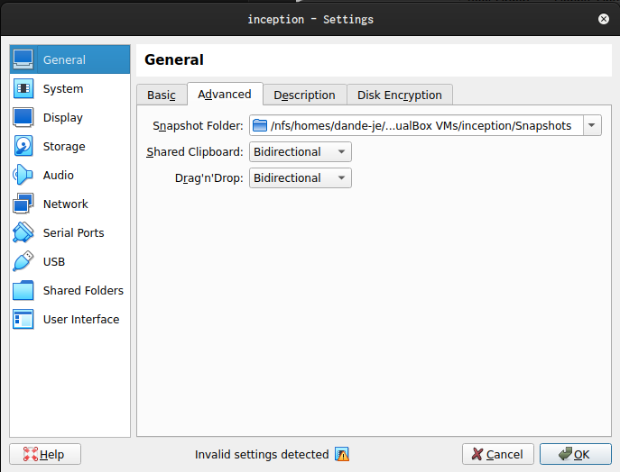
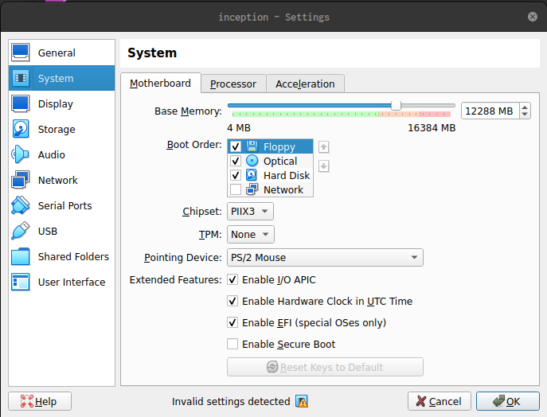
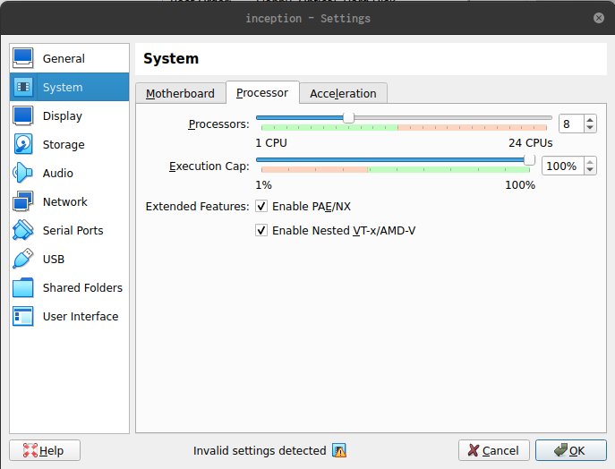
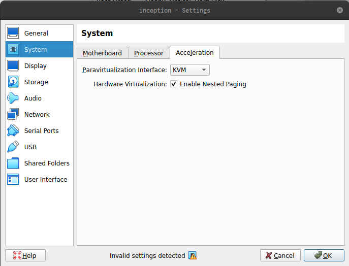
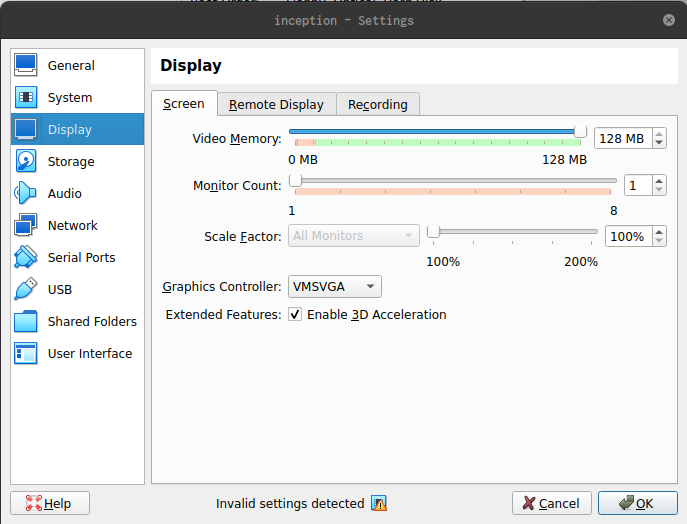
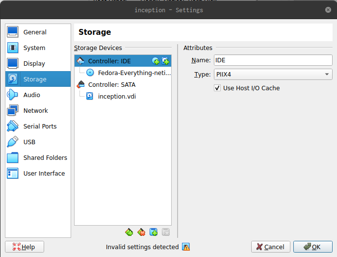
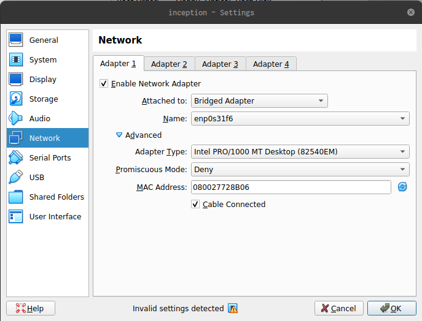

# 42 Inception

> **System Administration & DevOps Project**  
> Dockerized infrastructure featuring WordPress, MariaDB, and NGINX with bonus services, orchestrated via `docker-compose` on custom Debian-based images.

---

## Table of Contents

- [Overview](#overview)
- [Development Environment](#development-environment)
  - [Host Specifications](#host-specifications)
  - [Virtual Machine Configuration](#virtual-machine-configuration)
  - [VirtualBox Configuration Details](#virtualbox-configuration-details)
- [Installation Guide](#installation-guide)
  - [Initial System Setup](#initial-system-setup)
  - [SSH Configuration](#ssh-configuration)
  - [Docker Installation](#docker-installation)
  - [Development Tools](#development-tools)
- [Project Deployment](#project-deployment)
- [Architecture](#architecture)
- [Contributing](#contributing)
- [License](#license)

---

## Overview

This project implements a complete web infrastructure using Docker containers, demonstrating proficiency in:

- Container orchestration with Docker Compose
- Service isolation and networking
- Volume management and data persistence
- SSL/TLS configuration
- System administration best practices

**Key Constraint:** All volumes must reside in `/home/login/data` as per project requirements. VirtualBox shared folders are intentionally disabled to maintain proper Docker volume permissions and ensure compliance with project specifications.

---

## Development Environment

### Host Specifications

| Component | Specification |
|-----------|---------------|
| **Machine** | Dell OptiPlex 7400 All-in-One |
| **Processor** | Intel® Core™ i7-12700 (12 cores, 20 threads) |
| **Memory** | 16 GB DDR4 |
| **Graphics** | AMD Radeon™ RX 6500 XT |
| **Operating System** | Ubuntu 22.04.5 LTS |

### Virtual Machine Configuration

| Parameter | Value |
|-----------|-------|
| **Guest OS** | Fedora Everything 43 (64-bit) |
| **Hypervisor** | VirtualBox 7.x |
| **vCPUs** | 10 (Nested VT-x/AMD-V enabled) |
| **Memory** | 12 GB (12,288 MB) |
| **Storage** | 120 GB VDI (dynamically allocated) |
| **Video Memory** | 128 MB |
| **Graphics Controller** | VMSVGA with 3D acceleration |
| **Network Adapter** | Bridged (enp0s31f6) |
| **Virtualization** | KVM + Nested Paging |
| **Shared Folders** | Disabled |

#### Rationale for Disabled Shared Folders

VirtualBox shared folders introduce permission conflicts with Docker volumes and violate the project requirement that volumes must be located in `/home/login/data`. All development work is performed within the VM using SSH and Neovim.

### VirtualBox Configuration Details

<details>

<summary>Click to view configuration screenshots</summary>

- **General Settings**
  - 
  - 

- **System Settings**
  - 
  - 
  - 

- **Display Settings**
  - 

- **Storage Settings**
  - 

- **Network Settings**
  - 

</details>

---

## Installation Guide

### Initial System Setup

During Fedora installation, ensure **Development Tools** is selected and **Guest Agents** in the software selection screen.

After initial boot, execute the following commands:

```bash
# Update system packages
sudo dnf upgrade -y --refresh --setopt fastestmirror=1

# Configure hostname
sudo hostnamectl set-hostname inception --static

# Configure hosts
echo "127.0.0.1 dande-je.42.fr" | sudo tee -a /etc/hosts
# Reboot to apply changes
reboot
```

### SSH Configuration

#### Disable Root Login and Configure Custom Port

1. Edit SSH daemon configuration:

```bash
sudo vi /etc/ssh/sshd_config
```

2. Modify the following directives:

```plaintext
Port 4242
PermitRootLogin no
PasswordAuthentication yes
```

#### Generate SSH Key Pair

```bash
ssh-keygen -t rsa
```

#### Configure Firewall and SELinux

```bash
# Allow SSH on custom port
sudo firewall-cmd --add-port=4242/tcp --permanent

# Install SELinux policy utilities
sudo dnf install -y policycoreutils-python-utils

# Configure SELinux to allow SSH on port 4242
sudo semanage port -a -t ssh_port_t -p tcp 4242

# Reboot to apply all changes
reboot
```

#### Establish SSH Connection

1. Retrieve VM IP address:

```bash
hostname -I
```

2. Connect from host machine:

```bash
ssh your_login@your_vm_ip -p 4242
```

### Docker Installation

#### Install Docker CE and Required Components

```bash
# Install prerequisite packages
sudo dnf install -y dnf-plugins-core ca-certificates curl gnupg

# Add Docker repository
curl -fsSL https://download.docker.com/linux/fedora/docker-ce.repo | \
  sudo tee /etc/yum.repos.d/docker-ce.repo > /dev/null

# Install Docker packages
sudo dnf install -y docker-ce docker-ce-cli containerd.io \
  docker-buildx-plugin docker-compose-plugin

# Enable and start Docker services
sudo systemctl enable --now docker
sudo systemctl enable --now containerd

# Add current user to docker group
sudo usermod -aG docker $USER
newgrp docker
```

#### Install Docker Compose v1 (Legacy)

```bash
# Install compatibility library
sudo dnf install -y libxcrypt-compat

# Download Docker Compose binary
sudo curl -fsSL \
  https://github.com/docker/compose/releases/download/1.29.2/docker-compose-Linux-x86_64 \
  -o /usr/local/bin/docker-compose

# Make executable
sudo chmod +x /usr/local/bin/docker-compose
```

### Development Tools

```bash
sudo dnf install -y make git vim wget curl openssl \
  procps-ng net-tools bind-utils pwgen
```

---

## Project Deployment

Clone the repository:

```bash
git clone https://github.com/willtrigo/42_inception.git
cd 42_inception
```

### Setup Environment

1. `cp srcs/.env.example srcs/.env`
2. Edit `srcs/.env` with your values (e.g., DOMAIN_NAME).
3. Generate secrets: The command is in each file.
4. `make up` to build/start.

Follow project-specific instructions in the `Makefile` for building and deploying the infrastructure.

---

## Architecture

```
┌─────────────────────────────────────────────────┐
│              NGINX (Reverse Proxy)              │
│          Port 443 (TLS/SSL Enabled)             │
└─────────────────┬───────────────────────────────┘
                  │
        ┌─────────┴─────────┐
        │                   │
┌───────▼────────┐  ┌──────▼────────┐
│   WordPress    │  │   MariaDB     │
│  (PHP-FPM)     │  │   (MySQL)     │
└────────────────┘  └───────────────┘
        │                   │
        └─────────┬─────────┘
                  │
          ┌───────▼────────┐
          │  Docker Network │
          │   (inception)   │
          └─────────────────┘
```

---

## Contributing

This is an educational project for 42 School. Contributions are not accepted, but feel free to fork and adapt for your own learning purposes.

---

## License

This project is part of the 42 School curriculum and follows their educational policies.
